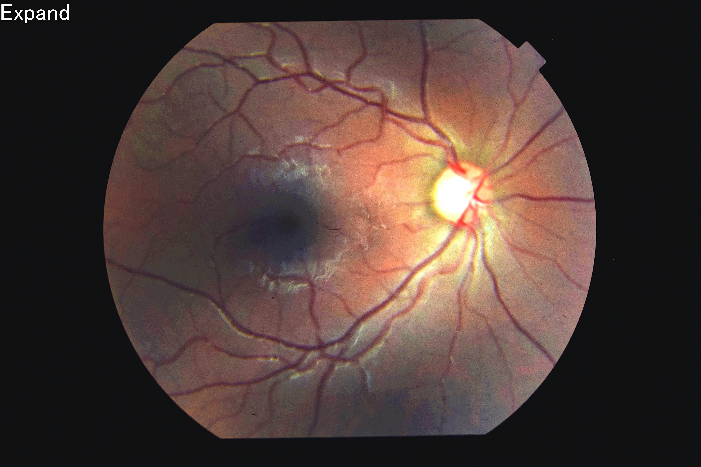
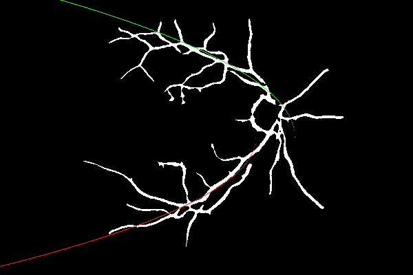

# Dual-parabolic Modeling Project of Advanced-Programming Graduate Course

You will find an interactive c++ project with the wxWidget tool for biomedical uses in this project. The project analyzes biomedical retina images and gives a model of the two major arteries with parabolas.

#Example of results

